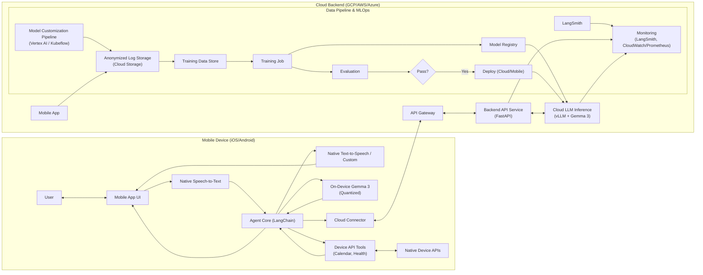

# Gemma 3 Mobile AI Assistant

[](...) <!-- Placeholder -->
[](LICENSE) <!-- Placeholder -->
[]() <!-- Placeholder -->

**A personalized, on-device first AI assistant for iOS and Android powered by Google's Gemma 3.**

This project aims to build a general-purpose AI assistant chatbot for mobile platforms. It leverages Google's state-of-the-art open model, Gemma 3, focusing on delivering a highly personalized, context-aware, and responsive experience. The assistant integrates seamlessly with core device features like Calendar and Health tracking, prioritizing user privacy and low-latency interactions through efficient on-device processing complemented by optional cloud capabilities.

---

## Table of Contents

*   [Key Features](#key-features)
*   [Architecture Overview](#architecture-overview)
*   [Technology Stack](#technology-stack)
*   [Project Structure](#project-structure)
*   [Getting Started](#getting-started)
    *   [Prerequisites](#prerequisites)
    *   [Installation](#installation)
    *   [Configuration](#configuration)
    *   [Model Setup](#model-setup)
*   [Running the Project](#running-the-project)
    *   [Running the Backend](#running-the-backend)
    *   [Running the Mobile App](#running-the-mobile-app)
    *   [Running Tests](#running-tests)
*   [Contributing](#contributing)
*   [License](#license)
*   [Related Documents](#related-documents)

---

## Key Features

*   **✨ Personalized Experience:** Customize the assistant's **name**, **voice** (multiple options), and **visual avatar**. The assistant learns user preferences over time.
*   **📱 Device Integration:** Seamlessly interact with device features via AI-driven tool usage:
    *   **📅 Calendar:** Check schedule, add events, set reminders.
    *   **❤️ Health Tracker:** Query steps, sleep, heart rate (via HealthKit/Health Connect).
    *   *(Extensible framework for adding more tools)*
*   **⚡ Real-Time Interaction:** Engage in natural conversation with low latency, featuring:
    *   Text and Voice input.
    *   Streaming text and synthesized voice output.
    *   Optimized on-device inference for speed and offline capability.
*   **🧠 General Intelligence:** Powered by **Google Gemma 3**, capable of handling diverse tasks:
    *   Factual Q&A, summarization, casual chat.
    *   Context awareness using conversation history and user profile.
    *   Leverages Gemma 3's long context window (128K tokens).
*   **🔒 Privacy-Focused:** Prioritizes **on-device processing** for sensitive data (calendar, health). Anonymized data handling for model improvement with user consent.
*   **☁️ Hybrid Architecture:** Primarily runs on-device, with optional fallback/escalation to a more powerful cloud-based Gemma 3 model for complex tasks.
*   **🔄 Continuous Learning:** Employs a Model Customization Pipeline (MCP) using PEFT (LoRA/QLoRA) and potentially DPO/RLHF for ongoing improvement based on user feedback and interactions.
*   **🔍 Observability:** Integrated with **LangSmith** for detailed tracing and debugging of agent behavior.

---

## Architecture Overview

The system uses a **hybrid, on-device first architecture**.



**Flow:** User interacts with the mobile app → Input processed by native STT → LangChain Agent Core running primarily on-device receives text → Agent uses quantized On-Device Gemma 3 (TF Lite/Core ML) for response → If needed, Agent invokes Device Tools (Calendar/Health via native bridges) → Agent formats final response → Response streamed to UI (text) and native TTS (speech) → Optionally, complex queries or fallbacks are routed via Cloud Connector to Backend API → Backend uses larger Gemma 3 via vLLM for inference → Response streamed back to device. The MCP runs offline to fine-tune models.

---

## Technology Stack

*   **AI Model:** Google Gemma 3 (1B/4B on-device, 12B/27B cloud)
*   **AI Orchestration:** LangChain, LangGraph
*   **Observability:** LangSmith
*   **Mobile:**
    *   iOS: Swift, SwiftUI/UIKit, Core ML, EventKit, HealthKit, AVSpeechSynthesizer, SFSpeechRecognizer
    *   Android: Kotlin, Jetpack Compose/XML, TensorFlow Lite (NNAPI delegate), CalendarContract, Health Connect SDK, TextToSpeech, SpeechRecognizer
*   **Mobile ML Runtimes:** TensorFlow Lite, Core ML (via converters), Google AI Edge SDKs (potential), llama.cpp wrappers (potential)
*   **Backend:** Python 3.10+, FastAPI
*   **Cloud Serving:** vLLM, Docker, Kubernetes (GKE/EKS/AKS) / Vertex AI Endpoints
*   **MLOps / Training:**
    *   Hugging Face: `transformers`, `peft` (LoRA, QLoRA), `trl` (DPO, PPO), `datasets`
    *   Pipeline Orchestration: Vertex AI Pipelines / Kubeflow Pipelines
    *   Experiment Tracking: MLflow / Weights & Biases
*   **Databases:**
    *   Mobile: EncryptedSharedPreferences (Android), Keychain/UserDefaults (iOS), potentially SQLCipher/Realm
    *   Cloud: Google Cloud Storage / AWS S3 (Logs, Models), PostgreSQL (optional - user accounts)
*   **Infrastructure:** Terraform / Pulumi (IaC), Google Cloud Platform (GCP) / AWS / Azure
*   **CI/CD:** GitHub Actions / GitLab CI / Jenkins, Argo CD / Flux / Spinnaker (potential)

---

## Project Structure

```
.
├── .github/workflows/        # CI/CD pipeline configurations
├── android/                  # Android native application source code
│   ├── app/
│   └── ...
├── backend/                  # FastAPI backend service source code
│   ├── app/
│   ├── Dockerfile
│   └── requirements.txt
├── docs/                     # Project documentation (PRD, TDD, Research, etc.)
├── infrastructure/           # Infrastructure as Code (Terraform/Pulumi)
├── ios/                      # iOS native application source code
│   ├── GemmaAssistant/
│   └── ...
├── mlops/                    # Scripts and configurations for MCP, training, evaluation
│   ├── pipelines/            # Kubeflow/Vertex AI pipeline definitions
│   ├── scripts/              # Training, evaluation, data processing scripts
│   └── notebooks/            # Experimental ML notebooks
├── models/                   # Placeholder for downloading/storing model artifacts locally
│   └── on-device/            # Location for placing converted TFLite/CoreML models
├── tests/                    # E2E tests, shared test resources
├── .gitignore
├── LICENSE                   # Project license file
└── README.md                 # This file
```

---

## Getting Started

### Prerequisites

*   **Git LFS:** For handling large model files (if checked in directly, otherwise download script needed).
*   **Mobile Development:**
    *   iOS: macOS, Xcode (latest stable version), CocoaPods / Swift Package Manager.
    *   Android: Android Studio (latest stable version), Android SDK, NDK (if using llama.cpp).
*   **Backend Development:** Python 3.10+, Poetry (or Pip + venv).
*   **Cloud:** Google Cloud SDK / AWS CLI / Azure CLI (depending on chosen provider), Terraform / Pulumi CLI.
*   **ML:** Access to Hugging Face Hub (for base models), sufficient compute (GPU recommended) for local testing/training if desired.
*   **Docker:** Docker Desktop or Docker Engine.
*   **LangSmith Account:** API Key for observability during development.

### Installation

1.  **Clone the repository:**
    ```bash
    git clone https://github.com/<your-org>/gemma-mobile-assistant.git
    cd gemma-mobile-assistant
    # If using Git LFS: git lfs pull
    ```

2.  **Backend Setup:**
    ```bash
    cd backend
    poetry install # or pip install -r requirements.txt
    cd ..
    ```

3.  **Mobile Setup:**
    *   **iOS:**
        ```bash
        cd ios
        # pod install (if using CocoaPods)
        # or resolve packages via Xcode (if using SPM)
        open GemmaAssistant.xcodeproj # Or .xcworkspace
        # Build project in Xcode
        cd ..
        ```
    *   **Android:**
        *   Open the `android` directory in Android Studio.
        *   Let Gradle sync and download dependencies.
        *   Build the project (Build -> Make Project).

4.  **Infrastructure Setup (Optional - for full cloud deployment):**
    ```bash
    cd infrastructure
    # Configure provider credentials (e.g., gcloud auth application-default login)
    terraform init
    terraform plan
    terraform apply # Review plan carefully before applying
    cd ..
    ```

### Configuration

1.  **Backend:**
    *   Copy `.env.example` to `.env` in the `backend` directory.
    *   Fill in necessary environment variables:
        *   `LANGSMITH_API_KEY`: Your LangSmith API key.
        *   `CLOUD_MODEL_ENDPOINT`: URL for the internal vLLM service (if deployed).
        *   `LOG_BUCKET_NAME`: Name of the Cloud Storage bucket for logs.
        *   `AUTH_SECRET_KEY`: Secret key for JWT authentication (if implemented).
        *   ... (other relevant keys for database, external APIs)
2.  **Mobile:**
    *   Configuration files or constants within the native code (`ios/GemmaAssistant/Configuration.swift`, `android/app/src/.../Constants.kt`) need to be updated with:
        *   `BACKEND_API_BASE_URL`: URL of your deployed backend API Gateway.
        *   `CLOUD_API_KEY`: Static API key or mechanism to fetch JWT for backend calls.
        *   `LANGSMITH_API_KEY`: (Optional, if tracing directly from mobile)

### Model Setup

*   **On-Device Model:**
    1.  You need to obtain the target Gemma 3 base model (e.g., 1B-IT).
    2.  Quantize and convert the model to `.tflite` (for Android) and `.mlmodelc` (for iOS) formats using appropriate scripts (potentially provided in `mlops/scripts/conversion`).
    3.  Place the converted model files into the correct asset directories:
        *   Android: `android/app/src/main/assets/`
        *   iOS: Add the `.mlmodelc` file to the Xcode project target (Copy Bundle Resources).
    4.  Ensure the mobile code references the correct model file names.
*   *(Alternative: Implement a download script or mechanism within the app to fetch pre-converted models from a secure location like GCS/S3).*

---

## Running the Project

### Running the Backend

```bash
cd backend
# Ensure .env file is configured
poetry run uvicorn app.main:app --reload --host 0.0.0.0 --port 8000
```
The backend API will be available at `http://localhost:8000`.

### Running the Mobile App

*   **iOS:**
    *   Open the project in Xcode (`ios/GemmaAssistant.xcodeproj` or workspace).
    *   Select a target Simulator or connected physical device.
    *   Ensure the backend URL configuration points to `http://<your-local-ip>:8000` (or deployed URL).
    *   Click the Run button (▶️).
*   **Android:**
    *   Open the project in Android Studio (`android` directory).
    *   Select a target Emulator or connected physical device.
    *   Ensure the backend URL configuration points to `http://10.0.2.2:8000` (for emulator) or `http://<your-local-ip>:8000` (for physical device).
    *   Click the Run button (▶️).

### Running Tests

*   **Backend Unit Tests:**
    ```bash
    cd backend
    poetry run pytest
    ```
*   **Mobile Unit/Integration Tests:**
    *   Run tests via Xcode's Test navigator (Cmd+U).
    *   Run tests via Android Studio's Test runner (Right-click `src/test` or `src/androidTest` -> Run Tests).
*   **E2E Tests (If implemented):**
    *   Follow instructions in the `tests/` directory (likely involving Appium setup or platform-specific test runners).

---

## Contributing

Contributions are welcome! Please follow these steps:

1.  **Fork** the repository.
2.  Create a new **branch** (`git checkout -b feature/your-feature-name`).
3.  Make your changes, adhering to the project's coding style and conventions.
4.  Add appropriate **unit/integration tests** for your changes.
5.  Ensure all tests pass.
6.  Commit your changes (`git commit -m 'Add some feature'`).
7.  Push to the branch (`git push origin feature/your-feature-name`).
8.  Open a **Pull Request** against the `main` branch.
9.  Ensure your PR description clearly explains the changes and motivation.

Please also refer to the `CONTRIBUTING.md` file (if available) for more detailed guidelines and the Code of Conduct.

---

## License

This project is licensed under the **Apache License 2.0**. See the [LICENSE](LICENSE) file for details.

---

## Related Documents

*   [Initial Research](docs/01_research.md)
*   [Product Requirements Document (PRD)](docs/02_prd.md)
*   [Technical Design Document (TDD)](docs/03_tdd.md)
*   [Project Plan & User Stories](docs/04_project_plan.md)
*   [Implementation Guide](docs/05_implementation_guide.md)
