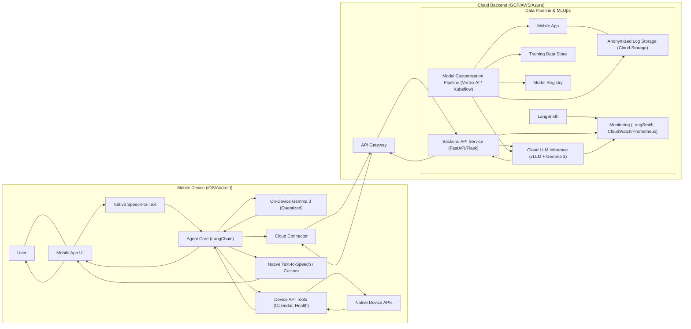
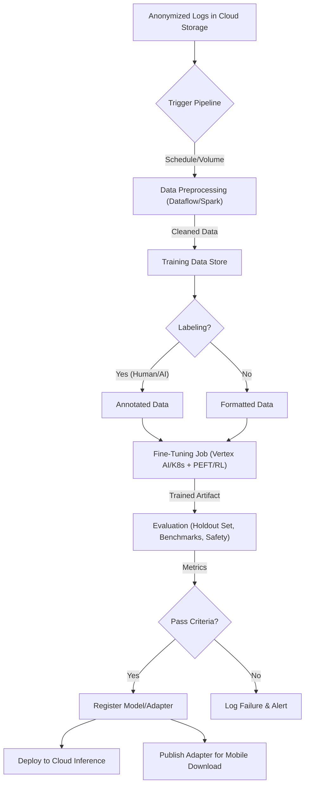

**Technical Design Document: Gemma 3 Mobile AI Assistant**

**Version:** 1.0
**Date:** April 12, 2025
**Author:** Roman Borysenok
**Status:** Draft

**Table of Contents**

1.  Introduction & Scope
2.  System Overview & Architecture
3.  Key Components & Modules
    3.1. User Interface (Mobile Client)
    3.2. API & Backend Services
    3.3. AI Model Layer (On-Device & Cloud)
    3.4. Agent Orchestration (LangChain)
    3.5. Data Storage & Management
    3.6. Integration with Device Features (Tools)
    3.7. Personalization Engine
4.  Data Flow & Pipelines
    4.1. User Interaction Data Flow
    4.2. Model Customization Pipeline (MCP) Data Flow
5.  Security & Privacy Considerations
6.  Performance & Scalability
7.  Deployment Architecture
    7.1. Environments
    7.2. CI/CD Pipeline
    7.3. Infrastructure
8.  Testing & Quality Assurance
9.  Observability & Monitoring
10. Risk Assessment & Mitigation
11. Future Enhancements & Extension Points

---

**1. Introduction & Scope**

**1.1. Introduction**
This document provides the technical design for the Gemma 3 Mobile AI Assistant, as outlined in the associated PRD (v1.0) and DeepResearch document. The goal is to build a general-purpose, personalized AI assistant for iOS and Android platforms, leveraging Google's Gemma 3 models. The system prioritizes real-time interaction, personalization (voice, name, avatar), seamless integration with device features (calendar, health), and user privacy through a hybrid on-device/cloud architecture.

**1.2. Scope**
This TDD covers the technical architecture, component design, technology stack, data flows, deployment strategy, testing, monitoring, security, and operational considerations for building and maintaining the AI assistant.

**In Scope:**
*   Detailed design of the mobile application architecture (iOS/Android).
*   Specification of the backend API services.
*   Design of the AI model serving layer (on-device and cloud).
*   Integration strategy for device APIs (Calendar, Health, etc.).
*   Data pipeline design for model training and continuous improvement (MCP).
*   Personalization mechanism implementation details.
*   Security, performance, scalability, deployment, testing, and monitoring plans.

**Out of Scope:**
*   Detailed UI/UX mockups and visual assets (refer to Design specifications).
*   Specific project management timelines and resource allocation (refer to Project Plan).
*   Detailed business logic unrelated to system architecture (e.g., specific conversation scripts beyond prompt examples).
*   Marketing and monetization strategies.

**2. System Overview & Architecture**

The system employs a **hybrid client-server architecture** designed for responsiveness and privacy. The primary interaction path utilizes on-device processing for speed and data locality, with an optional fallback/escalation path to a more powerful cloud backend.

**(Textual Description of Architecture Diagram)**

**Data/Request Flow (Primary On-Device):**
1.  User interacts via voice or text through the Mobile App UI.
2.  Voice input is processed by native STT; text input is captured directly.
3.  Transcribed text/input text is sent to the On-Device Agent Core (implemented using LangChain).
4.  The Agent Core formats the input with context (history, profile) into a prompt.
5.  The prompt is sent to the On-Device Gemma 3 model (quantized, running via TF Lite/Core ML/AI Edge SDK).
6.  **If required:** The agent determines a tool is needed (e.g., Calendar query). It invokes the corresponding Device API Tool wrapper.
7.  The Tool wrapper calls the native device API (e.g., EventKit/CalendarProvider) via platform channels/bridges.
8.  Native API returns data (e.g., calendar events) to the Tool wrapper.
9.  The Tool wrapper returns the result to the Agent Core.
10. The Agent Core adds the tool result to the context and may re-invoke the LLM.
11. The On-Device LLM generates the response text.
12. The Agent Core receives the response text.
13. The text is displayed in the UI and simultaneously sent to the selected TTS engine (native or custom).
14. The TTS engine synthesizes speech, which is played back to the user.

**Data/Request Flow (Cloud Fallback/Escalation):**
1.  Steps 1-4 as above.
2.  The Agent Core (or a pre-agent routing logic) determines the request requires cloud processing (complexity, user setting, on-device failure).
3.  The request (with necessary context) is securely sent via the Cloud Connector to the Backend API Gateway.
4.  The API Gateway authenticates the request and routes it to the Backend API Service.
5.  The Backend API Service invokes the Cloud LLM Inference service (running a larger Gemma 3 model via vLLM).
6.  The Cloud LLM generates the response.
7.  The response is streamed back through the Backend API, Gateway, and Cloud Connector to the Mobile App's Agent Core.
8.  Steps 12-14 proceed as above.

**3. Key Components & Modules**

**3.1. User Interface (Mobile Client)**
*   **Platform:** Native iOS (Swift, UIKit/SwiftUI) and Android (Kotlin, Compose/XML). Native preferred for optimal performance, access to device APIs, and leveraging platform-specific ML capabilities (Core ML, NNAPI). Cross-platform (Flutter/React Native) considered but deferred due to potential overhead with on-device inference and deep API integration.
*   **Input:** Standard text input fields. Microphone access triggering native SpeechRecognizer (Android) or SFSpeechRecognizer (iOS) for STT.
*   **Output:** Chat bubble interface displaying conversation history. Audio playback using native AVSpeechSynthesizer (iOS) or TextToSpeech (Android), configured with the user's selected voice ID. Avatar display (static image or simple lip-sync animation using libraries like Lottie for simple animations) updated based on user selection.
*   **Interaction:** Real-time UI updates for streaming text responses. Background threads for network calls and on-device inference to avoid blocking the main UI thread.

**3.2. API & Backend Services**
*   **Framework:** Python with FastAPI (preferred for async performance and typing) or Flask.
*   **Architecture:** Microservices preferred if complexity grows, but initially a monolithic backend API service might suffice for cloud inference proxying and potential future account management.
*   **Endpoints:**
    *   `/v1/chat/cloud`: Accepts POST requests with context (conversation history, user profile elements, query) for processing by the cloud LLM. Returns a streaming text response.
    *   `/v1/user/profile/sync` (Optional): For potential cloud backup/sync of non-sensitive preferences.
    *   `/v1/feedback`: Accepts POST requests with interaction ID and user feedback (rating, correction).
    *   `/v1/logs`: Endpoint for receiving anonymized logs from the client (if consented).
*   **Protocol:** RESTful APIs over HTTPS.
*   **Authentication:** JWT-based authentication for client-backend communication, issued upon user signup/login if cloud features require accounts, otherwise potentially device-based attestation or simpler API keys for basic cloud fallback.

**3.3. AI Model Layer (On-Device & Cloud)**
*   **On-Device Model:**
    *   **Model:** Gemma 3 variant (Target: 1B or 4B parameters), instruction-tuned base.
    *   **Quantization:** 4-bit integer quantization (int4) using tools like `bitsandbytes` during QLoRA or post-training quantization techniques compatible with target runtime. Explore lower bit-rates (e.g., 2-bit) if feasible and quality is maintained.
    *   **Runtime:**
        *   **Android:** TensorFlow Lite (.tflite model). Leverage NNAPI delegate for GPU/DSP acceleration. Potentially use Google AI Edge LLM Inference API if available and suitable. Explore `llama.cpp`/`ggml` wrappers via NDK if necessary for maximum optimization/compatibility.
        *   **iOS:** Core ML (.mlmodel or .mlpackage). Convert TensorFlow/PyTorch model using `coremltools`. Leverage Neural Engine via Core ML. Explore `llama.cpp`/`ggml` via Objective-C/Swift bindings.
    *   **Deployment:** Model file bundled with the app initial release. Updates (especially fine-tuned adapters) downloaded via background service from a secure CDN/repository (e.g., Cloud Storage, potentially HF Hub).
*   **Cloud Model:**
    *   **Model:** Larger Gemma 3 variant (Target: 12B or 27B parameters), instruction-tuned.
    *   **Serving Framework:** vLLM (recommended for optimized throughput and latency) deployed via Docker containers.
    *   **Hosting:** Kubernetes cluster (GKE, EKS, AKS) with GPU nodes (e.g., NVIDIA A100, H100) or managed service like Vertex AI Endpoints (which supports vLLM deployment for Gemma 3).
    *   **Inference:** Stateless API calls; context provided in each request. Supports streaming token generation.
*   **Fine-Tuning:**
    *   **Method:** Primarily PEFT (LoRA/QLoRA) using Hugging Face `PEFT` library for supervised fine-tuning on conversational data, tool usage examples, and personalization style data. AdaLoRA explored for potentially better parameter allocation.
    *   **Alignment:** DPO preferred for simplicity using preference pairs (human or AI-generated/RLAIF). RLHF (using Hugging Face `TRL` with PPO) considered for deeper alignment if high-quality human feedback is available and DPO proves insufficient.
    *   **Infrastructure:** Training jobs run on GPU instances managed by Vertex AI Training or Kubeflow on Kubernetes.

**3.4. Agent Orchestration (LangChain)**
*   **Framework:** LangChain (Python for backend/tool definition, potentially dart/swift bindings or a minimal core logic port/wrapper for on-device execution if full Python runtime is too heavy).
*   **Agent Type:** ReAct-style agent or dedicated Function Calling agent (leveraging Gemma 3's native capabilities if applicable/robust) capable of selecting and invoking defined tools.
*   **Prompting:** Carefully crafted system prompts defining the assistant's persona (based on user personalization settings like name, personality traits), available tools, and response guidelines. Context injection mechanism manages conversation history and user profile data within Gemma's context window limit (128K tokens).
*   **Memory:** `ConversationBufferMemory` (or sliding window variant) for short-term recall. User profile data loaded from local storage serves as long-term memory, injected into prompts.
*   **Tools:** Custom LangChain `Tool` implementations wrapping calls to device features (see 3.6).
*   **Complex Workflows:** LangGraph considered for future scenarios involving multi-step reasoning, agent collaboration, or cycles, but initial implementation relies on standard LangChain agent loops.

**3.5. Data Storage & Management**
*   **On-Device Storage:**
    *   **User Profile:** Encrypted key-value store (Android: EncryptedSharedPreferences; iOS: Keychain) or encrypted database (e.g., SQLCipher, Realm with encryption) for storing user name, assistant name, voice ID, avatar ID, personality settings, learned preferences (key facts).
    *   **Conversation History:** Potentially cached locally for session continuity (e.g., in a temporary local DB or file), respecting context window limits.
*   **Cloud Storage:**
    *   **Logs:** Anonymized interaction logs stored securely in object storage (Google Cloud Storage / AWS S3) with strict access controls and retention policies.
    *   **Training Data:** Processed and curated datasets for fine-tuning stored in object storage or a suitable data lakehouse format.
    *   **Model Artifacts:** Base models and fine-tuned adapters stored in a model registry (Vertex AI Model Registry, MLflow Tracking Server, HF Hub).
    *   **User Accounts (If needed):** Standard SQL (PostgreSQL) or NoSQL (DynamoDB/Firestore) database for user authentication details if full cloud accounts are implemented.
*   **Caching:** Redis or Memcached for backend API rate limiting, potentially caching expensive external API calls made by tools (if any added later, e.g., web search results). Limited use for core chat due to personalization.

**3.6. Integration with Device Features (Tools)**
*   **Mechanism:** LangChain `Tool` abstractions. Each tool corresponds to a specific device capability.
*   **Implementation:**
    *   Tool definition (description, parameters) within the LangChain agent setup.
    *   When a tool is invoked by the agent:
        *   A request is sent from the Agent Core (potentially running Python via KMP/embedded interpreter, or more likely, a core logic port) to the native mobile code layer via platform channels (Flutter), JavaScript Interface (React Native Bridge), or direct calls (Native).
        *   Native code executes the actual API call (e.g., `queryEvents` on Android CalendarProvider, `fetchEvents` on iOS EventKit, query HealthKit/Health Connect).
        *   Native code handles necessary permissions checks and requests.
        *   Results are serialized (e.g., JSON) and sent back to the Agent Core.
        *   The Agent Core receives the result and continues the reasoning loop.
*   **Supported Tools (V1):**
    *   `CalendarReader`: Queries events based on date/time range.
    *   `CalendarWriter`: Creates events, sets reminders.
    *   `HealthDataReader`: Reads step count, sleep duration, heart rate data (requires explicit user permission per platform).
*   **Extensibility:** The framework allows adding new tools by defining them in LangChain and implementing the corresponding native code bridge.

**3.7. Personalization Engine**
*   **Data Storage:** User selections (name, voice, avatar, personality flags) stored securely on-device (see 3.5). Learned preferences (e.g., "user prefers concise answers", "user's dog is named Rex") also stored locally.
*   **Application:**
    *   **Name:** Stored preference used in UI labels and injected into the system prompt (e.g., "Your name is {assistant_name}. You are assisting {user_name}.").
    *   **Voice:** Stored voice ID passed to the native TTS engine during initialization or speech synthesis request.
    *   **Avatar:** Stored avatar ID used to select and display the correct visual asset in the UI.
    *   **Personality:** Flags (e.g., `humor_level=high`, `formality=casual`) are used to conditionally modify parts of the system prompt or select different prompt templates to guide Gemma 3's response style.
    *   **Learned Preferences:** Key facts retrieved from local storage and summarized in the system prompt at the start of a session.
*   **Updates:** Learned preferences are updated based on explicit user feedback or implicitly derived patterns (requires careful design to avoid incorrect assumptions).

**4. Data Flow & Pipelines**

**4.1. User Interaction Data Flow**
(Described in Section 2 System Overview) - Focuses on real-time request/response handling.

**4.2. Model Customization Pipeline (MCP) Data Flow**
*   **Trigger:** Scheduled (e.g., weekly/monthly) or based on new data volume threshold in Log Storage.
*   **Orchestration:** Vertex AI Pipelines or Kubeflow Pipelines.
*   **Steps:**
    1.  **Ingestion:** Collect anonymized logs and user feedback from Cloud Storage/LogStore.
    2.  **Preprocessing & Cleaning:** Filter PII, remove sensitive content (based on heuristics/rules), format into standardized training records (e.g., prompt/response pairs, preference pairs `{'chosen': ..., 'rejected': ...}`). Store in Training Data Store. Run via Spark/Dataflow jobs.
    3.  **Labeling (Optional):** Apply automated labeling (RLAIF using a strong LLM) or route data subsets to a human annotation platform for creating preference pairs or quality scores.
    4.  **Fine-Tuning:** Launch a training job (Vertex AI Training / Kubernetes Job) using the latest base model/adapter and the new curated data. Use PEFT (LoRA/QLoRA) or DPO/RLHF(PPO) techniques. Track experiment using MLflow or W&B.
    5.  **Evaluation:** Evaluate the newly trained adapter/model on a holdout dataset (measuring perplexity, task-specific metrics, accuracy) and potentially against benchmark tests (e.g., HELM Lite, custom interaction scenarios). Run safety/bias evaluations.
    6.  **Registration:** If evaluation metrics meet thresholds and safety checks pass, register the new model artifact (adapter weights or full model) in the Model Registry with versioning.
    7.  **Deployment:**
        *   **Cloud:** Trigger deployment of the new model to the Cloud LLM Inference service using blue-green or canary strategy.
        *   **On-Device:** Publish the new adapter file to the CDN/repository. The mobile app periodically checks for updates and downloads the new adapter when available (e.g., on Wi-Fi).

**(Textual Flowchart for MCP)**

**5. Security & Privacy Considerations**

*   **Encryption:**
    *   **In Transit:** TLS 1.2+ for all mobile-backend and backend-internal communication.
    *   **At Rest:** Platform-provided encryption for on-device storage (File-Based Encryption on Android, Data Protection on iOS). AES-256 encryption for data in cloud storage (server-side encryption enabled).
*   **Data Minimization:** Collect only necessary data. On-device processing preferred for sensitive data (health, calendar details never leave device unless explicit cloud action triggered). Anonymize logs thoroughly before storing in the cloud.
*   **Compliance:** Adhere to GDPR/CCPA: clear user consent for data collection/processing (especially logs for training), provide mechanisms for data access/deletion. If health data interaction implies HIPAA scope, implement required technical safeguards (audit logs, stricter access control, potentially BAA with cloud provider).
*   **Authentication & Authorization:** JWT for mobile-backend API calls. Strict IAM roles/policies for cloud resources. Role-based access control within backend services if needed.
*   **API Security:** HTTPS enforcement, input validation, output encoding, rate limiting (using tools like Redis), protection against common web vulnerabilities (OWASP Top 10). Use API Gateway features for security.
*   **Content Safety:** Utilize Gemma 3's built-in safety classifiers. Implement additional filtering layers if necessary (e.g., keyword blocking, secondary moderation model) before displaying responses.
*   **Dependency Scanning:** Regularly scan code and dependencies for vulnerabilities (e.g., Snyk, Dependabot).
*   **Secure Coding Practices:** Follow platform-specific secure coding guidelines.

**6. Performance & Scalability**

*   **Targets:** Meet PRD objectives (e.g., <1.5s on-device P95 latency, <2.5s cloud P95 latency). High availability (>99.9% for cloud services).
*   **On-Device Performance:**
    *   Aggressive quantization (int4 target).
    *   Leverage hardware accelerators (NNAPI delegates, Core ML Neural Engine).
    *   Optimize model loading time (potentially memory-mapping).
    *   Run inference off the main thread.
    *   Profile resource usage (CPU, GPU, memory, battery) on target devices.
    *   Consider smaller model variants for lower-end devices if necessary.
*   **Cloud Scalability:**
    *   **Compute:** Horizontal Pod Autoscaler (HPA) in Kubernetes based on GPU utilization / requests per second, or managed scaling features of Vertex AI Endpoints.
    *   **Serving Engine:** vLLM for high-throughput, low-latency inference via continuous batching.
    *   **API:** Backend API service scaled horizontally (multiple instances behind load balancer).
    *   **Database:** Use managed database services with read replicas or auto-scaling capabilities if DB load becomes significant.
*   **Network:** Streaming responses (token-by-token) to minimize perceived latency. Use efficient serialization formats (e.g., Protobuf if applicable). CDN for distributing static assets and model files.
*   **Load Balancing:** Cloud-native load balancer (e.g., Google Cloud Load Balancer, AWS ELB) distributing traffic across backend API instances and potentially inference service instances.

**7. Deployment Architecture**

**7.1. Environments**
*   **Development:** Local developer machines, potentially cloud-based sandboxes for backend/ML components.
*   **Staging:** A full replica of the production environment used for integration testing, QA, and pre-release validation. Uses separate cloud resources and databases.
*   **Production:** The live environment serving end-users.

**7.2. CI/CD Pipeline**
*   **Source Control:** Git (e.g., GitHub, GitLab, Bitbucket). Feature branch workflow.
*   **CI (Continuous Integration):** Triggered on code commits/merges.
    *   Tools: GitHub Actions, Jenkins, GitLab CI, Cloud Build.
    *   Steps: Linting, static analysis, unit tests, build mobile app binaries (debug/staging), build backend Docker images. Push images to container registry (e.g., Docker Hub, GCR, ECR).
*   **CD (Continuous Deployment):**
    *   Tools: Argo CD, Flux, Spinnaker, platform-specific deployment tools (e.g., `gcloud app deploy`, Serverless framework).
    *   **Backend:** Automated deployment to Staging upon successful CI build of main branch. Manual trigger (or automated with checks) for deployment to Production using Blue/Green or Canary strategy.
    *   **Mobile App:** Builds pushed to app distribution platforms (TestFlight/Firebase App Distribution for internal/beta testing). Manual submission to App Store / Google Play for production releases (phased rollouts enabled).
    *   **ML Models:** MCP pipeline handles deployment of updated models/adapters to cloud inference service and publishing for mobile download (see 4.2).

**7.3. Infrastructure**
*   **Cloud Provider:** GCP, AWS, or Azure (Choice depends on team familiarity, existing infra, cost). GCP favored given Gemma/Vertex AI integration.
*   **Containerization:** Docker for backend services and ML model serving/training.
*   **Orchestration:** Kubernetes (GKE/EKS/AKS) for managing backend and ML serving containers. Alternatively, managed services like Vertex AI Endpoints/Training, AWS SageMaker, Azure ML.
*   **Infrastructure as Code (IaC):** Terraform or Pulumi for provisioning and managing cloud resources.

**8. Testing & Quality Assurance**

*   **Unit Testing:**
    *   Backend: PyTest for testing individual functions, classes, API endpoints logic (mocking external dependencies).
    *   Mobile: JUnit/Robolectric (Android), XCTest (iOS) for testing UI logic, view models, utility functions.
    *   ML: Tests for data preprocessing steps, tool wrappers.
*   **Integration Testing:**
    *   Test interactions between mobile app and backend API (using tools like `requests` or dedicated clients).
    *   Test LangChain agent's ability to correctly invoke mocked tools.
    *   Test full flow from API Gateway to Inference Service.
    *   Use Postman/Newman collections run within CI pipeline.
*   **End-to-End (E2E) Testing:**
    *   Automated UI tests using Appium, Espresso (Android), or XCUITest (iOS) to simulate user journeys (login, chat, use calendar tool, change personalization).
*   **Model Quality Testing:**
    *   Part of the MCP evaluation step. Includes accuracy on holdout sets, benchmark tests (e.g., conversation quality, factual correctness), robustness checks (adversarial inputs), bias/fairness assessments, and safety evaluations.
    *   LangSmith used extensively for tracing agent behavior, debugging tool use, and running LLM-based evaluations.
*   **Performance Testing:**
    *   Load testing backend APIs using JMeter, Locust, or k6.
    *   Measure on-device inference speed, memory usage, and battery impact using platform profiling tools (Android Studio Profiler, Xcode Instruments).
*   **Security Testing:** Static Application Security Testing (SAST), Dynamic Application Security Testing (DAST), dependency scanning, manual penetration testing before major releases.

**9. Observability & Monitoring**

*   **Metrics:**
    *   System: CPU, memory, disk I/O, network traffic (node/pod/container level).
    *   Application: API request latency, error rates (HTTP 5xx, 4xx), request throughput.
    *   ML Model: Inference latency (on-device & cloud), token generation speed, model-specific metrics (e.g., perplexity drift if applicable), tool invocation success/failure rates.
    *   Tools: Prometheus client libraries in backend services, CloudWatch/Monitoring agents, mobile SDKs for performance monitoring (e.g., Firebase Performance).
*   **Logging:**
    *   Structured logging (JSON format) from backend services, mobile app (where appropriate), and inference servers.
    *   Centralized logging platform (ELK stack, Loki/Grafana, Cloud Logging, Datadog Logs).
    *   Crucially, use LangSmith for detailed tracing of LangChain agent execution steps, including prompts, tool inputs/outputs, and intermediate reasoning.
*   **Tracing:**
    *   Distributed tracing using OpenTelemetry SDKs integrated into backend services and API gateway.
    *   Backend: Jaeger, Tempo, Cloud Trace, Datadog APM. Trace requests across mobile -> gateway -> backend -> inference service.
*   **Dashboards:** Grafana, Cloud Dashboards, Datadog Dashboards visualizing key metrics and logs. Specific dashboards for API health, model performance, resource utilization, MCP pipeline status.
*   **Alerting:** Prometheus Alertmanager, CloudWatch Alarms, Datadog Monitors. Alerts configured for critical errors (e.g., high 5xx rate), performance degradation (latency spikes), resource exhaustion, security events, MCP pipeline failures. Alerts routed to appropriate teams via PagerDuty, Opsgenie, Slack.

**10. Risk Assessment & Mitigation**

*   **Risk:** On-device model performance insufficient on older/low-end devices.
    *   **Mitigation:** Rigorous testing on target device range; provide option to use smaller model variant; rely more on cloud fallback for affected devices; optimize quantization/runtime aggressively.
*   **Risk:** Gemma 3 Function Calling proves unreliable for tool use.
    *   **Mitigation:** Fallback to ReAct agent prompting; extensive prompt engineering; fine-tune model specifically for tool invocation patterns; build robust error handling around tool calls.
*   **Risk:** Privacy violation due to logging or data handling errors.
    *   **Mitigation:** Strict anonymization routines in MCP; prioritize on-device processing; conduct privacy reviews and audits; minimize data collection; robust consent management.
*   **Risk:** Cloud inference costs become excessive.
    *   **Mitigation:** Optimize on-device usage to minimize cloud reliance; use efficient serving (vLLM); leverage spot instances for non-critical tasks (like batch training); monitor costs closely; implement user-level rate limits for cloud usage if necessary.
*   **Risk:** Vendor lock-in (e.g., specific cloud AI services).
    *   **Mitigation:** Use open-source models (Gemma 3) and frameworks (LangChain, vLLM, TF Lite, Core ML); use standard containerization (Docker/K8s); use IaC for easier migration; design for portability where feasible.
*   **Risk:** Latency in hybrid switching (deciding between on-device/cloud).
    *   **Mitigation:** Develop clear, fast heuristics for routing; potentially pre-warm cloud endpoint; optimize network path.
*   **Risk:** Inconsistent behavior between on-device and cloud models.
    *   **Mitigation:** Use instruction-tuned models from the same family; fine-tune both with similar datasets/objectives; extensive testing to characterize differences; potentially use cloud model for evaluation/RLAIF feedback for on-device model.

**11. Future Enhancements & Extension Points**

*   **Multilingual Support:** Architecture supports loading different language models or relying on Gemma 3's multilingual capabilities. Requires localization of UI and potentially language-specific prompt tuning.
*   **Multimodal Input (Images):** Extend Agent Core and mobile UI to handle image input. Pass image data (e.g., base64 encoded or via URL) to Gemma 3 (requires variant supporting vision). Requires updates to prompting and potentially new tools for image analysis.
*   **New Tool Integrations:** Modular LangChain tool design allows easily adding tools for new device features (e.g., Contacts, Email, Music Player) or third-party APIs (e.g., Weather, Web Search, Smart Home) by implementing the native bridge and Tool definition.
*   **Advanced Personalization:** Explore on-device federated learning or secure aggregation techniques for privacy-preserving model updates based on user interactions (complex, V2+).
*   **Proactive Assistance:** Requires background processing capabilities on mobile, event listeners (e.g., for calendar changes, location updates), and a mechanism to trigger agent prompts based on these events, respecting battery life and user permissions.
*   **Offline Mode Improvements:** Enhance offline capabilities beyond basic chat, potentially caching data needed by tools (e.g., recent calendar view) or using smaller, specialized models for specific offline tasks.
